.# NeoBank — Closed-Loop Digital Wallet System

## 1. Overview

NeoBank is a closed-loop INR wallet backend built with Spring Boot 4 and Java 21. It demonstrates production-grade financial engineering patterns — ledger-first accounting, idempotent transactions, distributed locking, and event-driven processing — deployed on AWS (EC2, RDS, S3).

Users sign up via OAuth or email, verify their phone via OTP, receive a wallet, and can top up, transfer, or withdraw money. Every money movement is recorded as an immutable ledger entry. A DB-based outbox with a scheduled poller handles async side effects (notifications, payouts), and Redis handles distributed locking and OTP storage.

---

## 2. Tech Stack

| Layer | Technology |
|---|---|
| Language | Java 21 |
| Framework | Spring Boot 4.0.2 |
| Database | PostgreSQL 16 (AWS RDS) |
| Cache / Locking | Redis 7 (Upstash) |
| Async Events | DB Outbox + @Scheduled Poller |
| Migrations | Flyway |
| Auth | OAuth2 + Email/Password → Phone OTP + JWT |
| Email | Resend (SMTP) |
| SMS | Simulated (swappable interface) |
| File Storage | AWS S3 |
| API Docs | Springdoc OpenAPI (Swagger) |
| Mapping | MapStruct 1.6 |
| Testing | JUnit 5 + Testcontainers |
| Containerization | Docker + Docker Compose |
| Deployment | AWS EC2 + RDS + S3 |

---

## 3. Architecture

Modular monolith with strict domain boundaries. Each module owns its entities, services, and controllers. Modules communicate through direct service calls within the same JVM — no HTTP between modules.

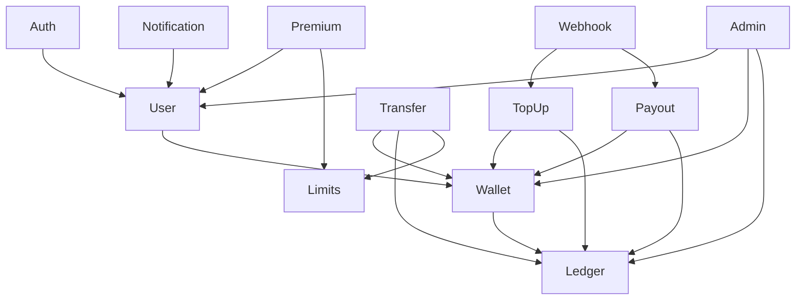

### Module Layout

```
src/main/java/com/neobank/
├── NeoApplication.java
├── common/
│   ├── config/
│   ├── exception/
│   ├── dto/
│   └── util/
├── auth/
│   ├── controller/
│   ├── service/
│   └── dto/
├── user/
│   ├── controller/
│   ├── service/
│   ├── repository/
│   ├── entity/
│   ├── dto/
│   └── mapper/
├── wallet/
├── ledger/
├── transfer/
├── topup/
├── payout/
├── notification/
├── premium/
├── limits/
└── admin/
```

---

## 4. Database Schema

### ER Diagram

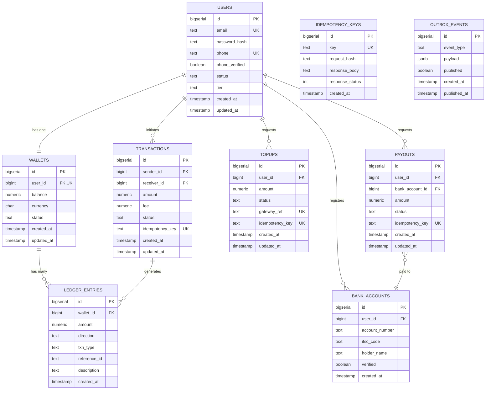

### Table Details

#### users
| Column | Type | Constraints |
|---|---|---|
| id | BIGSERIAL | PRIMARY KEY |
| email | TEXT | UNIQUE |
| password_hash | TEXT | NULLABLE (OAuth users) |
| phone | TEXT | UNIQUE |
| phone_verified | BOOLEAN | NOT NULL DEFAULT false |
| status | TEXT | CHECK (ACTIVE, SUSPENDED) |
| tier | TEXT | CHECK (FREE, PREMIUM) |
| created_at | TIMESTAMP | NOT NULL DEFAULT now() |
| updated_at | TIMESTAMP | NOT NULL DEFAULT now() |

#### wallets
| Column | Type | Constraints |
|---|---|---|
| id | BIGSERIAL | PRIMARY KEY |
| user_id | BIGINT | UNIQUE, FK → users |
| balance | NUMERIC(18,2) | NOT NULL DEFAULT 0, CHECK ≥ 0 |
| currency | CHAR(3) | DEFAULT 'INR', CHECK = 'INR' |
| status | TEXT | CHECK (ACTIVE, FROZEN) |
| created_at | TIMESTAMP | NOT NULL DEFAULT now() |
| updated_at | TIMESTAMP | NOT NULL DEFAULT now() |

#### ledger_entries
| Column | Type | Constraints |
|---|---|---|
| id | BIGSERIAL | PRIMARY KEY |
| wallet_id | BIGINT | FK → wallets |
| amount | NUMERIC(18,2) | NOT NULL, CHECK > 0 |
| direction | TEXT | CHECK (CREDIT, DEBIT) |
| txn_type | TEXT | CHECK (TOPUP, P2P, WITHDRAW, FEE, REVERSAL) |
| reference_id | TEXT | NOT NULL |
| description | TEXT | NULLABLE |
| created_at | TIMESTAMP | NOT NULL DEFAULT now() |

Immutable — entries are never updated or deleted.

#### transactions (P2P transfers)
| Column | Type | Constraints |
|---|---|---|
| id | BIGSERIAL | PRIMARY KEY |
| sender_id | BIGINT | FK → users |
| receiver_id | BIGINT | FK → users |
| amount | NUMERIC(18,2) | NOT NULL |
| fee | NUMERIC(18,2) | DEFAULT 0 |
| status | TEXT | CHECK (INIT, PROCESSING, SUCCESS, FAILED) |
| idempotency_key | TEXT | UNIQUE |
| created_at | TIMESTAMP | NOT NULL DEFAULT now() |
| updated_at | TIMESTAMP | NOT NULL DEFAULT now() |

#### topups
| Column | Type | Constraints |
|---|---|---|
| id | BIGSERIAL | PRIMARY KEY |
| user_id | BIGINT | FK → users |
| amount | NUMERIC(18,2) | NOT NULL |
| status | TEXT | CHECK (INIT, PROCESSING, SUCCESS, FAILED) |
| gateway_ref | TEXT | UNIQUE |
| idempotency_key | TEXT | UNIQUE |
| created_at | TIMESTAMP | NOT NULL DEFAULT now() |
| updated_at | TIMESTAMP | NOT NULL DEFAULT now() |

#### payouts
| Column | Type | Constraints |
|---|---|---|
| id | BIGSERIAL | PRIMARY KEY |
| user_id | BIGINT | FK → users |
| bank_account_id | BIGINT | FK → bank_accounts |
| amount | NUMERIC(18,2) | NOT NULL |
| status | TEXT | CHECK (INIT, PROCESSING, SUCCESS, FAILED) |
| idempotency_key | TEXT | UNIQUE |
| created_at | TIMESTAMP | NOT NULL DEFAULT now() |
| updated_at | TIMESTAMP | NOT NULL DEFAULT now() |

#### bank_accounts
| Column | Type | Constraints |
|---|---|---|
| id | BIGSERIAL | PRIMARY KEY |
| user_id | BIGINT | FK → users |
| account_number | TEXT | NOT NULL |
| ifsc_code | TEXT | NOT NULL |
| holder_name | TEXT | NOT NULL |
| verified | BOOLEAN | DEFAULT false |
| created_at | TIMESTAMP | NOT NULL DEFAULT now() |

#### idempotency_keys
| Column | Type | Constraints |
|---|---|---|
| id | BIGSERIAL | PRIMARY KEY |
| key | TEXT | UNIQUE |
| request_hash | TEXT | NOT NULL |
| response_body | TEXT | NOT NULL |
| response_status | INT | NOT NULL |
| created_at | TIMESTAMP | NOT NULL DEFAULT now() |

#### outbox_events
| Column | Type | Constraints |
|---|---|---|
| id | BIGSERIAL | PRIMARY KEY |
| event_type | TEXT | NOT NULL |
| payload | JSONB | NOT NULL |
| published | BOOLEAN | DEFAULT false |
| created_at | TIMESTAMP | NOT NULL DEFAULT now() |
| published_at | TIMESTAMP | NULLABLE |

---

## 5. Features

### Core
- Email/password signup with BCrypt hashing
- Google OAuth2 sign-in
- Mandatory phone OTP verification (Redis-backed, 5-min TTL)
- JWT authentication with refresh tokens
- Auto wallet creation after phone verification
- Wallet balance inquiry

### Money In
- Top-up via Razorpay sandbox
- Webhook-based payment confirmation
- Ledger CREDIT entry + atomic balance update

### Money Out — P2P
- Transfer by receiver's phone number
- Daily/monthly limit enforcement
- Redis distributed lock + DB row-level lock
- Paired DEBIT/CREDIT ledger entries
- Fee calculation (tier-based)

### Money Out — Bank Withdrawal
- Register and verify bank account
- Initiate payout (immediate wallet debit)
- Async payout processing via outbox poller
- Webhook callback for success/failure
- Automatic reversal on failure

### Notifications
- Email via Resend on every financial event
- Simulated SMS (swappable interface)
- Triggered by outbox event poller

### Premium Tier
- Higher daily/monthly limits
- CSV transaction export (async job → S3)
- Higher API rate limits (Redis-based)

### Admin
- View/search users and wallets
- Freeze/unfreeze wallets
- View ledger and transactions

### Developer
- Swagger UI for API exploration
- API keys for programmatic access (premium)

---

## 6. Application Flows

### Authentication Flow

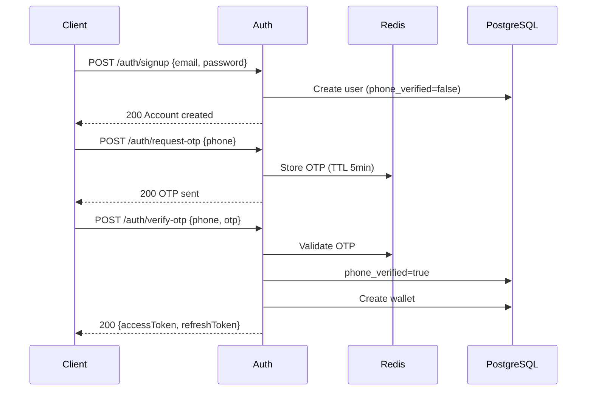

### Top-Up Flow

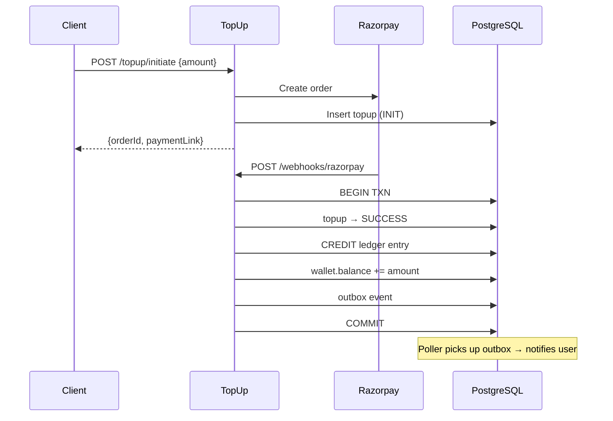

### P2P Transfer Flow

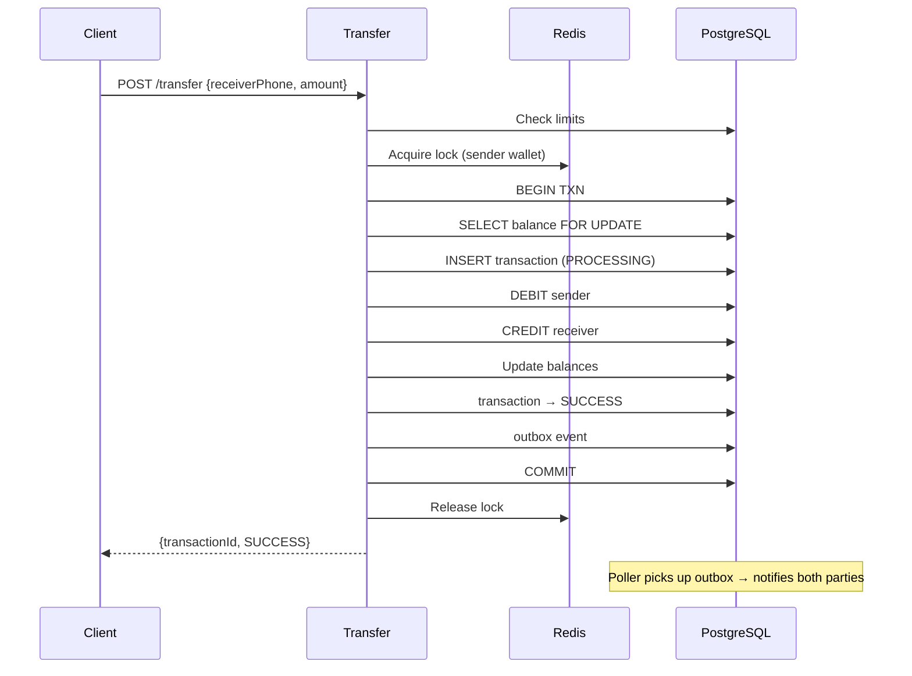

### Withdrawal Flow

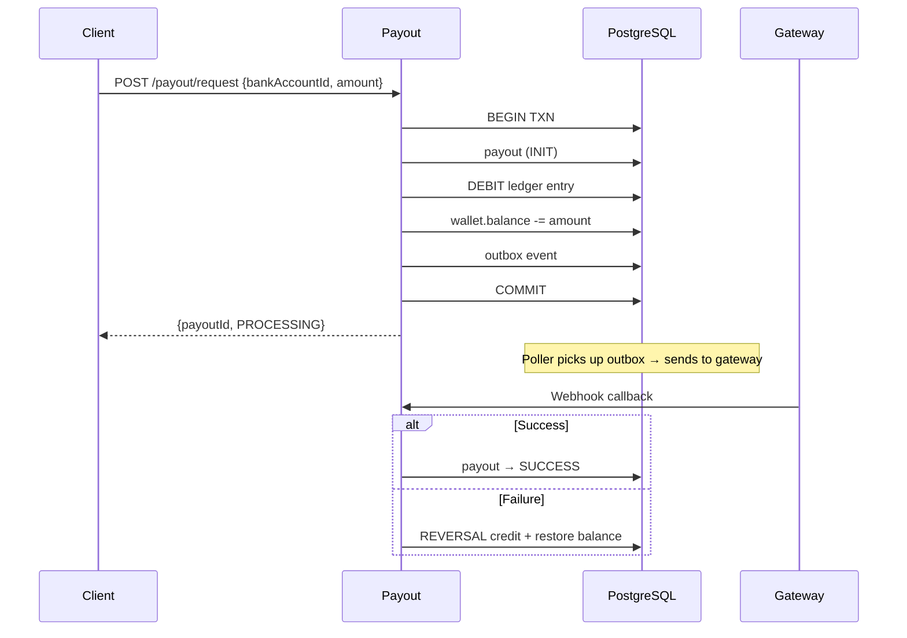

---

## 7. State Machines

### User Lifecycle

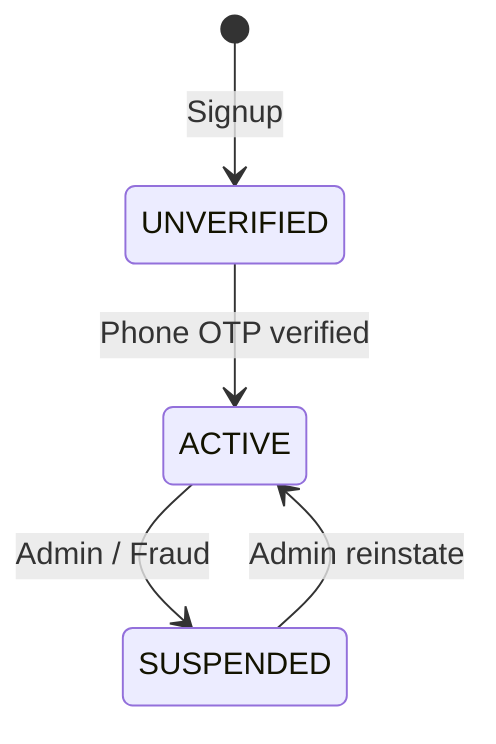

### Wallet Lifecycle

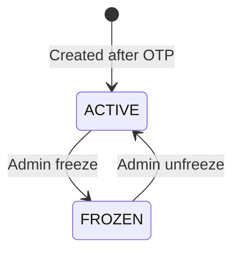

### Transaction States

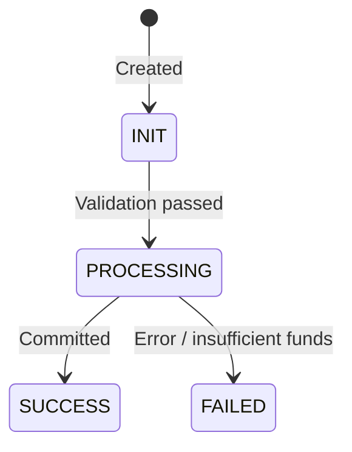

---

## 8. Ledger System

Every money movement creates immutable ledger entries. Balance is cached in `wallets.balance` and updated atomically within the same DB transaction.

| Scenario | Entry 1 | Entry 2 |
|---|---|---|
| Top-up ₹500 | CREDIT to user (TOPUP) | — |
| P2P ₹200 | DEBIT sender (P2P) | CREDIT receiver (P2P) |
| Withdraw ₹1000 | DEBIT user (WITHDRAW) | — |
| Fee ₹5 | DEBIT user (FEE) | — |
| Failed withdrawal | CREDIT user (REVERSAL) | — |

P2P entries share the same `reference_id` for pairing.

**Reconciliation**: Hourly job verifies `wallets.balance == SUM(credits) - SUM(debits)`.

---

## 9. Idempotency

Client sends `Idempotency-Key` header (UUID). Server checks:

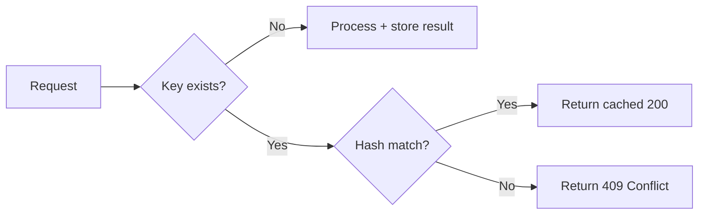

Applied on: `/topup/initiate`, `/transfer`, `/payout/request`, all webhooks.

---

## 10. Distributed Locking

Redis locks prevent concurrent operations on the same wallet.

```
Key:   wallet:lock:{walletId}
TTL:   10 seconds
```

Acquire via `SET NX EX`. Release via Lua script (owner verification).

Used for P2P transfers (sender side) and withdrawals.

---

## 11. Event-Driven Architecture

### Event Types

| Event | Purpose |
|---|---|
| TOPUP_COMPLETED | Notify user of successful top-up |
| TRANSFER_COMPLETED | Notify sender and receiver |
| PAYOUT_REQUESTED | Trigger payout processing |
| PAYOUT_COMPLETED | Notify user of payout result |

### Outbox Pattern

Events written to `outbox_events` table inside the same DB transaction as the business logic. A `@Scheduled` poller runs every 5 seconds, picks up unpublished events, processes them (sends notifications, triggers payouts), and marks them as published. Guarantees at-least-once delivery without external messaging infrastructure.

---

## 12. Notifications

| Event | Email | SMS |
|---|---|---|
| Account created | ✅ | — |
| Phone verified | ✅ | ✅ |
| Top-up successful | ✅ | ✅ |
| P2P sent | ✅ | ✅ |
| P2P received | ✅ | ✅ |
| Withdrawal initiated | ✅ | ✅ |
| Withdrawal success | ✅ | ✅ |
| Withdrawal failed | ✅ | ✅ |
| Premium activated | ✅ | — |

Email via Resend SMTP. SMS simulated with swappable interface.

---

## 13. Limits & Fees

| Tier | Daily Limit | Monthly Limit |
|---|---|---|
| FREE | ₹25,000 | ₹2,00,000 |
| PREMIUM | ₹75,000 | ₹10,00,000 |

Limits computed from ledger DEBIT entries by date range. Fees are tier-based (percentage + flat) and create separate FEE ledger entries.

---

## 14. API Endpoints

All endpoints under `/api/v1/`.

### Auth
| Method | Endpoint | Description |
|---|---|---|
| POST | /auth/signup | Email + password registration |
| POST | /auth/login | Email + password login |
| POST | /auth/oauth/google | Google OAuth callback |
| POST | /auth/request-otp | Request phone OTP |
| POST | /auth/verify-otp | Verify OTP → create wallet |
| POST | /auth/refresh | Refresh access token |

### User
| Method | Endpoint | Description |
|---|---|---|
| GET | /users/me | Current user profile |
| PUT | /users/me | Update profile |
| POST | /users/me/upgrade | Upgrade to premium |

### Wallet
| Method | Endpoint | Description |
|---|---|---|
| GET | /wallet | Get wallet details + balance |
| GET | /wallet/dashboard | Aggregated metrics + trends |

### Top-Up
| Method | Endpoint | Description |
|---|---|---|
| POST | /topup/initiate | Create Razorpay order |
| GET | /topup/history | Top-up history (paginated) |

### Transfer
| Method | Endpoint | Description |
|---|---|---|
| POST | /transfer | Send money to phone number |
| GET | /transfer/history | Transfer history (paginated) |
| GET | /transfer/{id} | Transfer details |

### Payout
| Method | Endpoint | Description |
|---|---|---|
| POST | /payout/bank-account | Register bank account |
| GET | /payout/bank-accounts | List bank accounts |
| POST | /payout/request | Initiate withdrawal |
| GET | /payout/history | Payout history (paginated) |

### Transactions
| Method | Endpoint | Description |
|---|---|---|
| GET | /transactions | All transactions (paginated, filterable) |
| GET | /transactions/{id} | Transaction details |
| GET | /transactions/export | CSV export (async, premium) |

### Webhooks
| Method | Endpoint | Description |
|---|---|---|
| POST | /webhooks/razorpay | Razorpay payment callback |
| POST | /webhooks/payout | Payout gateway callback |

### Admin
| Method | Endpoint | Description |
|---|---|---|
| GET | /admin/users | Search users |
| GET | /admin/users/{id} | User details |
| POST | /admin/wallets/{id}/freeze | Freeze wallet |
| POST | /admin/wallets/{id}/unfreeze | Unfreeze wallet |
| GET | /admin/ledger | Browse ledger entries |
| GET | /admin/reconciliation | Run reconciliation check |

---

## 15. Scheduled Jobs

| Job | Frequency |
|---|---|
| Outbox event publisher | Every 5s |
| Balance reconciliation | Hourly |
| Stuck payout sweeper | Every 15min |
| Premium expiry check | Daily |
| Idempotency key cleanup | Daily |

---

## 16. Error Handling

Consistent error response format:

```json
{
  "error": {
    "code": "INSUFFICIENT_BALANCE",
    "message": "Balance ₹800 is less than ₹1000",
    "traceId": "abc-123"
  }
}
```

Failed withdrawals trigger automatic REVERSAL ledger entries. All errors carry a correlation `traceId` for debugging.

---

## 17. Security

- Passwords hashed with BCrypt
- JWT access tokens (30-min TTL) + refresh tokens (7-day TTL)
- Phone OTP stored in Redis with TTL, locked after 5 failed attempts
- Webhook signature verification
- Non-root Docker user
- Secrets via environment variables (Resend key, DB password, JWT signing key)
- Frozen wallets block all debit operations
- Rate limiting via Redis (token bucket)

---

## 18. Infrastructure

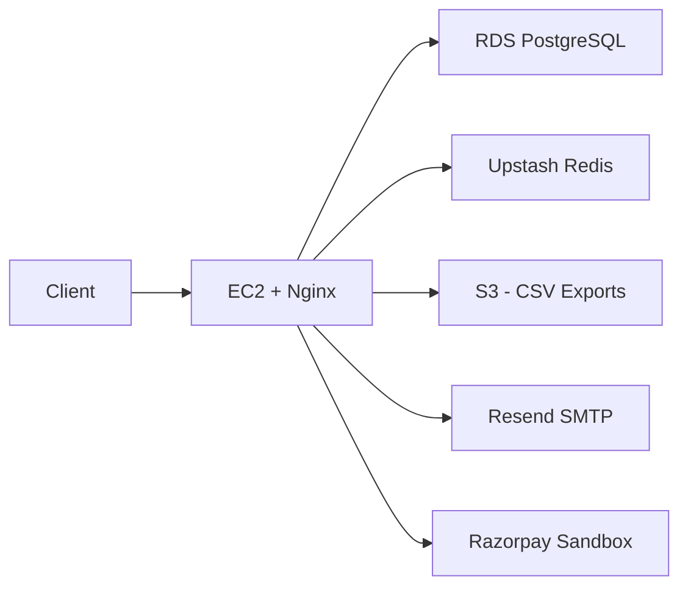

- Docker image pushed to ECR, deployed on EC2 (t2.micro free tier)
- RDS for managed PostgreSQL (db.t3.micro free tier)
- Upstash for managed Redis (free tier)
- S3 for file storage (free tier)
- Nginx reverse proxy on EC2
- Flyway runs migrations on startup
- Monthly cost: ₹0

---

## 19. Build Phases

| Phase | Modules | Deliverable |
|---|---|---|
| 1 | common, auth, user, wallet | Signup → OTP → wallet created |
| 2 | ledger, topup, webhook | Add money, ledger entries |
| 3 | transfer, limits | P2P with limits + locking |
| 4 | payout, webhook | Withdraw to bank, reversals |
| 5 | premium, notification | Tier upgrade, email/SMS |
| 6 | admin, scheduled jobs | Dashboard, reconciliation |
